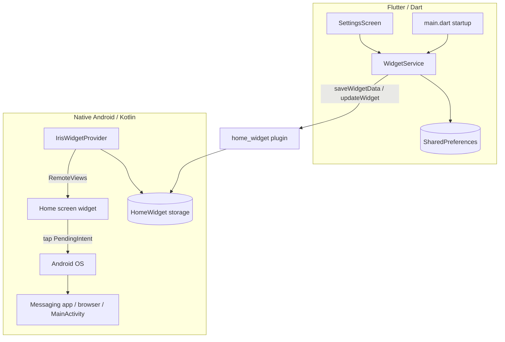
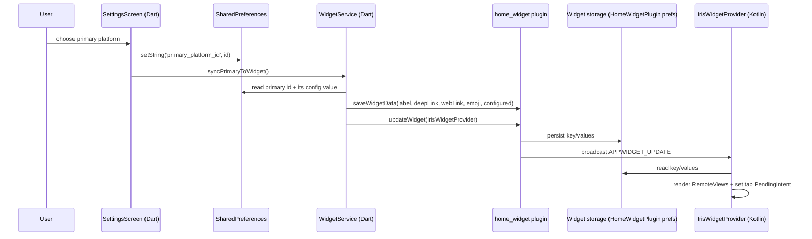
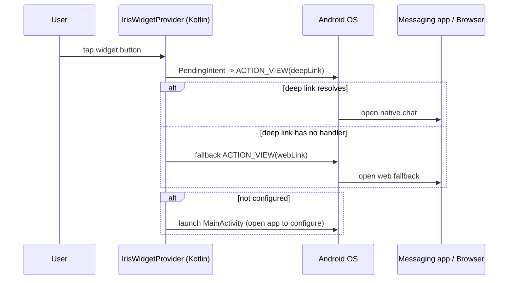

# Design Document: Android Home Screen Widget

## Overview

Add an Android home screen widget to `iris_shortcut` that quick-launches a single user-chosen "primary" messaging platform's Iris deep link directly from the launcher, without first opening the Flutter app. The bridge uses the `home_widget` package: Dart writes the primary platform's launch data into shared widget storage, a native Kotlin `AppWidgetProvider` renders a `RemoteViews` button, and a tap fires an `Intent` that resolves the platform's `deepLinkTemplate` (with `webFallbackTemplate` as backup).

Scope: Android-only. The Dart sync layer is written so an iOS WidgetKit extension could reuse it later, but no iOS native code is built here.

## Architecture

Three layers cooperate through `home_widget`'s shared storage:



- **Dart layer** owns the source of truth (`SharedPreferences`): which platform is primary and each platform's config value.
- **`home_widget` bridge** copies the derived launch data into storage both sides can read and triggers native redraws.
- **Native layer** (`IrisWidgetProvider`) only reads that storage to render and to wire the tap intent. It contains no business logic beyond deep→web fallback.

## Components and Interfaces

| Component | Layer | Responsibility |
|-----------|-------|----------------|
| `WidgetService` | Dart | Derive `WidgetPayload` from prefs, persist to widget storage, trigger redraw, manage primary selection. (Interface defined in **Core Interfaces/Types**.) |
| `SettingsScreen` (modified) | Dart | Add "Set as widget primary" control; call `setPrimaryPlatform` and `syncPrimaryToWidget` on save/clear. |
| `main.dart` (modified) | Dart | Call `syncPrimaryToWidget()` on startup to keep the widget current. |
| `IrisWidgetProvider` | Kotlin | Render `RemoteViews`, attach tap `PendingIntent`, perform deep→web fallback. (See **Native Android Components**.) |
| `home_widget` plugin | Bridge | Shared key/value storage + update broadcasts. |

Full method signatures and pre/post-conditions are specified in the **Core Interfaces/Types** and **Key Functions with Formal Specifications** sections below.

## Data Models

The single data structure crossing the bridge is `WidgetPayload` (Dart), serialized to five string keys in widget storage. Full Dart definition appears in **Core Interfaces/Types**; the model and its validation rules:

| Field | Type | Validation / Rule |
|-------|------|-------------------|
| `platformId` | String | `''` or equal to some `allPlatforms[*].id` |
| `label` | String | non-empty; defaults to platform `name`, or `"Iris"` placeholder |
| `emoji` | String | platform `iconEmoji`, or `"✦"` placeholder |
| `deepLink` | String | resolved `deepLinkTemplate` with `{value}` substituted, or `''` |
| `webLink` | String | resolved `webFallbackTemplate` with `{value}` substituted, or `''` |
| `configured` | bool | `true` iff a valid primary is chosen AND its config value is non-empty/non-whitespace |

Storage key mapping (Dart `WidgetKeys` ↔ Kotlin `WidgetKeys`): `label`/`LABEL`, `emoji`/`EMOJI`, `deepLink`/`DEEP_LINK`, `webLink`/`WEB_LINK`, `configured`/`CONFIGURED`. The primary selection itself lives in app `SharedPreferences` under `primary_platform_id` (not pushed as a widget field).

## Main Algorithm/Workflow

### Flow A: User selects/updates the primary platform (app is open)



### Flow B: User taps the widget on the home screen



## Core Interfaces/Types

### Dart side — `lib/services/widget_service.dart`

```dart
/// Data pushed to the native widget for the single primary platform.
class WidgetPayload {
  final String platformId;     // e.g. "telegram"; "" when none chosen
  final String label;          // platform.name, shown on the widget
  final String emoji;          // platform.iconEmoji
  final String deepLink;       // resolved deepLinkTemplate, "" if unavailable
  final String webLink;        // resolved webFallbackTemplate, "" if unavailable
  final bool configured;       // true iff a primary is chosen AND its value is non-empty

  const WidgetPayload({
    required this.platformId,
    required this.label,
    required this.emoji,
    required this.deepLink,
    required this.webLink,
    required this.configured,
  });

  /// Empty/placeholder payload shown when no primary is configured.
  static const WidgetPayload empty = WidgetPayload(
    platformId: '', label: 'Iris', emoji: '✦',
    deepLink: '', webLink: '', configured: false,
  );
}

/// Keys shared between Dart and the native widget (must match Kotlin constants).
abstract class WidgetKeys {
  static const String primaryPlatformPref = 'primary_platform_id'; // in SharedPreferences
  static const String label = 'iris_widget_label';
  static const String emoji = 'iris_widget_emoji';
  static const String deepLink = 'iris_widget_deeplink';
  static const String webLink = 'iris_widget_weblink';
  static const String configured = 'iris_widget_configured';
}

abstract class WidgetService {
  /// Build the payload for the currently selected primary platform.
  Future<WidgetPayload> buildPayload();

  /// Persist payload to widget storage and trigger a native redraw.
  Future<void> syncPrimaryToWidget();

  /// Set which platform is primary, then sync.
  Future<void> setPrimaryPlatform(String platformId);

  /// Read the currently selected primary platform id ('' if none).
  Future<String> getPrimaryPlatformId();
}
```

### Native side — Kotlin constants (`IrisWidgetProvider.kt`)

```kotlin
object WidgetKeys {
    const val LABEL = "iris_widget_label"
    const val EMOJI = "iris_widget_emoji"
    const val DEEP_LINK = "iris_widget_deeplink"
    const val WEB_LINK = "iris_widget_weblink"
    const val CONFIGURED = "iris_widget_configured"
}
```

## Key Functions with Formal Specifications

### Dart: `WidgetService.buildPayload()`

```dart
Future<WidgetPayload> buildPayload()
```

**Preconditions:**
- `SharedPreferences` is available.
- `allPlatforms` from `platforms_data.dart` is loaded.

**Postconditions:**
- If `primary_platform_id` is empty OR does not match any `allPlatforms[*].id` → returns `WidgetPayload.empty` (`configured == false`).
- Else let `p` be the matching platform and `v = prefs.getString(p.configKey) ?? ''`:
  - If `v` is empty → `configured == false`, `label == p.name`, `emoji == p.iconEmoji`, `deepLink == '' && webLink == ''`.
  - If `v` is non-empty → `configured == true`, `deepLink == p.buildDeepLink(v) ?? ''`, `webLink == p.buildWebLink(v) ?? ''`, `label == p.name`, `emoji == p.iconEmoji`.
- No mutation of `SharedPreferences` or `allPlatforms`.

### Dart: `WidgetService.syncPrimaryToWidget()`

```dart
Future<void> syncPrimaryToWidget()
```

**Preconditions:**
- `home_widget` plugin initialized (app group/name configured on Android).

**Postconditions:**
- Widget storage contains exactly the five `WidgetKeys` values derived from `buildPayload()`.
- A widget update broadcast is dispatched to `IrisWidgetProvider`.
- Idempotent: calling twice with unchanged inputs leaves widget storage in the same state and produces the same rendered widget.

### Dart: `WidgetService.setPrimaryPlatform(id)`

```dart
Future<void> setPrimaryPlatform(String platformId)
```

**Preconditions:**
- `platformId` is either `''` (clear primary) or equal to some `allPlatforms[*].id`.

**Postconditions:**
- `prefs.getString('primary_platform_id') == platformId` after return.
- `syncPrimaryToWidget()` has been invoked, so widget storage reflects the new primary.
- If `platformId` matches no platform, the primary is treated as cleared and the widget shows the placeholder.

### Kotlin: `IrisWidgetProvider.onUpdate(...)`

```kotlin
override fun onUpdate(context: Context, manager: AppWidgetManager, ids: IntArray)
```

**Preconditions:**
- Called by the OS or after a `home_widget` update broadcast.

**Postconditions:**
- For every `appWidgetId` in `ids`, a `RemoteViews` is built and pushed via `manager.updateAppWidget`.
- If `CONFIGURED == "true"`: the button shows `EMOJI + LABEL` and its tap `PendingIntent` targets `ACTION_VIEW(DEEP_LINK)`.
- If `CONFIGURED != "true"`: the button shows a "Set up Iris" placeholder and its tap `PendingIntent` launches `MainActivity`.

### Kotlin: tap handling

```kotlin
fun launchIntentFor(context: Context, deepLink: String, webLink: String): Intent
```

**Preconditions:**
- At least one of `deepLink` / `webLink` is non-empty when `configured`.

**Postconditions:**
- Returns an `ACTION_VIEW` intent for `deepLink` if non-empty; the provider attaches a fallback to `webLink`.
- Returned intent carries `FLAG_ACTIVITY_NEW_TASK` (required to start an Activity from a widget context).
- Resolution against the messaging apps relies on the existing `<queries>` / `QUERY_ALL_PACKAGES` already in the manifest.

## Algorithmic Pseudocode

### Dart: build + sync

```dart
Future<WidgetPayload> buildPayload() async {
  final prefs = await SharedPreferences.getInstance();
  final id = prefs.getString(WidgetKeys.primaryPlatformPref) ?? '';
  if (id.isEmpty) return WidgetPayload.empty;

  final p = allPlatforms.where((e) => e.id == id).firstOrNull;
  if (p == null) return WidgetPayload.empty;

  final v = (prefs.getString(p.configKey) ?? '').trim();
  if (v.isEmpty) {
    return WidgetPayload(
      platformId: p.id, label: p.name, emoji: p.iconEmoji,
      deepLink: '', webLink: '', configured: false,
    );
  }
  return WidgetPayload(
    platformId: p.id,
    label: p.name,
    emoji: p.iconEmoji,
    deepLink: p.buildDeepLink(v) ?? '',
    webLink: p.buildWebLink(v) ?? '',
    configured: true,
  );
}

Future<void> syncPrimaryToWidget() async {
  final payload = await buildPayload();
  await HomeWidget.saveWidgetData<String>(WidgetKeys.label, payload.label);
  await HomeWidget.saveWidgetData<String>(WidgetKeys.emoji, payload.emoji);
  await HomeWidget.saveWidgetData<String>(WidgetKeys.deepLink, payload.deepLink);
  await HomeWidget.saveWidgetData<String>(WidgetKeys.webLink, payload.webLink);
  await HomeWidget.saveWidgetData<String>(
      WidgetKeys.configured, payload.configured.toString());
  await HomeWidget.updateWidget(
    name: 'IrisWidgetProvider',
    androidName: 'IrisWidgetProvider',
  );
}
```

### Kotlin: render

```kotlin
override fun onUpdate(context: Context, manager: AppWidgetManager, ids: IntArray) {
    val prefs = HomeWidgetPlugin.getData(context) // SharedPreferences backing home_widget
    val configured = prefs.getString(WidgetKeys.CONFIGURED, "false") == "true"
    val label = prefs.getString(WidgetKeys.LABEL, "Iris") ?: "Iris"
    val emoji = prefs.getString(WidgetKeys.EMOJI, "✦") ?: "✦"
    val deepLink = prefs.getString(WidgetKeys.DEEP_LINK, "") ?: ""
    val webLink = prefs.getString(WidgetKeys.WEB_LINK, "") ?: ""

    for (id in ids) {
        val views = RemoteViews(context.packageName, R.layout.iris_widget)
        if (configured && deepLink.isNotEmpty()) {
            views.setTextViewText(R.id.widget_label, "$emoji  $label")
            views.setOnClickPendingIntent(
                R.id.widget_root,
                tapPendingIntent(context, id, deepLink, webLink)
            )
        } else {
            views.setTextViewText(R.id.widget_label, "✦  Set up Iris")
            views.setOnClickPendingIntent(
                R.id.widget_root,
                openAppPendingIntent(context, id)
            )
        }
        manager.updateAppWidget(id, views)
    }
}
```

## Example Usage

```dart
// In SettingsScreen: a "Set as widget" control per platform.
await widgetService.setPrimaryPlatform('telegram'); // saves pref + syncs widget

// After saving/clearing any platform's config value, refresh the widget
// so the primary's link stays current.
await prefs.setString('telegram_username', 'iris_ai');
await widgetService.syncPrimaryToWidget();

// On app startup (main.dart), keep widget in sync with current prefs.
WidgetsFlutterBinding.ensureInitialized();
await widgetService.syncPrimaryToWidget();
```

```kotlin
// AndroidManifest.xml receiver registration (inside <application>):
// <receiver android:name=".IrisWidgetProvider" android:exported="false">
//   <intent-filter>
//     <action android:name="android.appwidget.action.APPWIDGET_UPDATE" />
//   </intent-filter>
//   <meta-data android:name="android.appwidget.provider"
//              android:resource="@xml/iris_widget_info" />
// </receiver>
```

## Native Android Components (files to add)

- `android/app/src/main/kotlin/com/example/iris_shortcut/IrisWidgetProvider.kt` — `AppWidgetProvider` subclass (extends `HomeWidgetProvider`).
- `android/app/src/main/res/layout/iris_widget.xml` — `RemoteViews` layout: a rounded dark `#0A0A0F` background, purple `#7C6AF7` accent, a single `TextView`/button `widget_label` inside a root `widget_root`.
- `android/app/src/main/res/xml/iris_widget_info.xml` — `appwidget-provider` metadata (min sizes, `previewImage`, `resizeMode`, `updatePeriodMillis`).
- `android/app/src/main/res/drawable/iris_widget_preview.png` (or vector) — widget picker preview.
- `android/app/src/main/res/drawable/iris_widget_bg.xml` — rounded-rect background shape.
- `AndroidManifest.xml` — add the `<receiver>` block above. Existing `<queries>` and `QUERY_ALL_PACKAGES` already cover deep-link resolution; no new permission needed.

## Error Handling

- **No primary chosen / value cleared:** `buildPayload()` returns `WidgetPayload.empty`; widget renders "Set up Iris" and tapping opens the app.
- **Deep link has no handler (app not installed):** native tap handler falls back to `webLink`; if both fail, the OS shows its standard "no app found" behavior. (Native widgets cannot `canLaunchUrl`-probe as cleanly as Dart, so fallback ordering is deep → web.)
- **Stale primary id (platform removed from `allPlatforms`):** treated as not configured → placeholder.
- **`home_widget` plugin not initialized on a platform:** `syncPrimaryToWidget()` is a no-op-safe call guarded so the app does not crash on unsupported platforms.

## Testing Strategy

- **Unit / property tests (Dart):** `buildPayload()` is a pure-ish function over (`primary_platform_id`, per-platform config values, `allPlatforms`). This is the high-value target for property-based testing using a fake `SharedPreferences`. Library: `package:test` + `flutter_test` with manual generators (or `glados`/`fast_check`-style loops, min 100 iterations).
- **Example tests:** explicit cases for empty primary, configured primary, cleared value, unknown id.
- **Native rendering / intent dispatch:** verified by example-based instrumentation or manual QA, not property tests (RemoteViews + OS intents are infrastructure, not pure logic).

## Correctness Properties

*A property is a characteristic or behavior that should hold true across all valid executions of a system — a formal statement about what the system should do.*

> Note: requirement references below are finalized in Phase 2 after requirements are derived from this design.

### Property 1: Payload reflects configured primary

For any platform `p` in `allPlatforms` and any non-empty, non-whitespace config value `v` stored at `p.configKey`, after setting `p` as primary, `buildPayload()` returns `configured == true` with `label == p.name`, `deepLink == p.buildDeepLink(v)`, and `webLink == p.buildWebLink(v)`.

### Property 2: Unconfigured primary yields placeholder

For any state where the primary id is empty, matches no platform, or its config value is empty/whitespace, `buildPayload()` returns `configured == false` and emits no deep link.

### Property 3: Set-primary round trip

For any platform id chosen via `setPrimaryPlatform(id)`, reading `getPrimaryPlatformId()` returns the same id, and the synced widget storage's link fields equal the fields from `buildPayload()` for that id.

### Property 4: Sync idempotence

For any fixed `SharedPreferences` state, invoking `syncPrimaryToWidget()` two or more times results in identical widget storage values after each call.

### Property 5: Deep link substitution correctness

For any platform with a `deepLinkTemplate` containing `{value}` and any config value `v`, the synced `deepLink` contains `v` substituted for every `{value}` occurrence and contains no literal `{value}` token.

## Dependencies

- `home_widget` (new) — Dart↔native widget bridge and shared storage.
- Existing: `shared_preferences`, `url_launcher`, `google_fonts`, `flutter`.

## Notes / Flags

- There is a stale, unused duplicate model at `lib/models/platform_model.dart` (its own `ShortcutPlatform` plus a hand-rolled `Color`). The app uses `lib/models/platforms_data.dart`. This feature reads only from `platforms_data.dart`; the duplicate is irrelevant here but worth deleting in a future cleanup to avoid confusion.
- Android `applicationId` is still `com.example.iris_shortcut`; widget classes live under that package.
